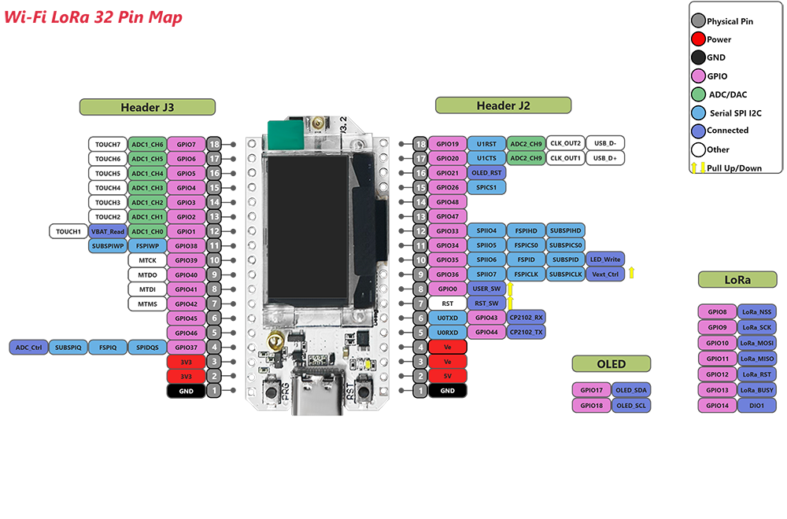

  <a href="https://codemetal.ai">
    <picture>
      <source media="(prefers-color-scheme: dark)" srcset="figs/CM_LIGHT_LOGO.png">
      <source media="(prefers-color-scheme: light)" srcset="figs/CM_DARK_LOGO.png">
      
    </picture>
  </a>

# Smarter Cities 

This hackathon focuses on advancing operations in smart cities through innovative use of existing infrastructure and emerging technologies, with particular emphasis on protecting personnel while maintaining operational effectiveness. The challenge explores the dual nature 
of urban technology both as a tool for special operations and as a potential vulnerability to be managed.
- Develop solutions that leverage existing smart city infrastructure (traffic cameras, WiFi networks, IoT sensors) to create real-time situational awareness systems for special operations.
- Design innovative methods to shield personnel from unauthorized remote sensing and tracking, while maintaining their ability to effectively communicate and coordinate during operations.
- Create algorithms or systems that can identify and analyze patterns in urban data streams - such as cellular network or other RF activity - to enhance response capabilities without compromising operational security.
- Engineer dual-use applications that can transform common smart city technologies (like public WiFi, traffic management systems, or environmental sensors) into tactical advantages for special operations, while ensuring these systems remain resistant to adversarial exploitation.

# Quickstart 
References to tools and sample repos for the various hardware
and a section with the demos

### Resources in this repo:

[If you need to reimage your Raspberry Pi](https://www.raspberrypi.com/software/)

get_WiF_dets.py is python to run in tandem with transmit_BT_full.ino to collect bluetooth detections over UDP from ESP32s3s

### External Resources:
[Another bluetooth RSSI trilateration on github](https://github.com/avibn/indoor-positioning-trilateration/tree/main).  
Fewer features, but entirely in python/micropython 

[Passive Radar](https://hackaday.com/2015/06/05/building-your-own-sdr-based-passive-radar-on-a-shoestring/  )  
With a little bit of soldering, and snooping for code on line, you can have a simple passive RADAR. We're close to the airport, so you are likely to detect planes moving with the antennas that come in the RTL-SDR box. There are many good emitter choices   

## SDRs

[pyadi for adalm-pluto SDR in python](https://wiki.analog.com/resources/tools-software/linux-software/pyadi-iio)

[dual receive and dual transmit on Pluto](https://www.youtube.com/watch?v=ph0Kv4SgSuI)  
this is also an introduction to commands on the microproccesor on the pluto 

1.5 mw @ 2.4 GHz on pluto TX  

### MATLAB for adalm-pluto/RTL
If MATLAB's your preferred language and you don't have a personal license, MATLAB offers a free trial that includes the Communications toolbox  

## microcontrollers

### Micropython

To use python on microcontrollers, you must [download firmware and flash it](https://micropython.org/download/ESP32_GENERIC_S3/)  

This alone will not have the full functionality of python, there is no numpy or pip by default  

[Numpy on microcontroller](https://github.com/v923z/micropython-ulab)  this may prove more trouble than it's worth to most...  

#### Thonny
The Thonny IDE is the recommended method to code in micropython. It comes preinstalled in Raspbian and board management is simply handled in the GUI on the bottom bar, and package management is in Tools > Manage Plugins  

### PlatformIO (c++ or python)
PlatformIO is a vscode extension for micropython, supports most of the same, but board managmenet is done with an .ini file  

### Arduino IDE (c++ microcontrollers)
use board/library manager to install necessary items, File>Examples contains many good examples of basic functionality
#### boards:  
esp32 by Espressif  
#### libraries (contains set required to use all examples in this library):  
Adafruit_BusIO  
Adafruit_DotStar  
Adafruit_DotStarMatrix  
Adafruit_GFX_Library  
Adafruit_SSD1306_EMULATOR  
ArduinoJson  
CircularBuffer  
ESP8266_and_ESP32_OLED_driver_for_SSD1306_displays  
ESP_Telnet  
Heltec_ESP32_Dev-Boards  
Heltec_ESP32_LoRa_v3  
Heltec_LoRa_OLED_Examples  
HotButton  
LiquidCrystal  
RadioLib  
TinyGPS  
TinyGPSPlus  
Windows: C:\Users\[YourUsername]\Documents\Arduino\libraries  
Mac: ~/Documents/Arduino/libraries  
Linux: ~/Arduino/libraries  

[esp32 simulation](https://wokwi.com/esp32)

